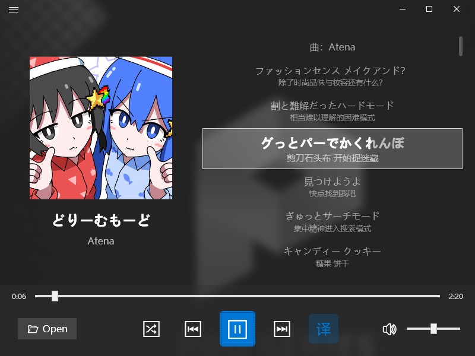

  
  <h2>WpfMusicPlayer</h2>

[![zread](https://img.shields.io/badge/Ask_Zread-_.svg?style=for-the-badge&color=00b0aa&labelColor=000000&logo=data%3Aimage%2Fsvg%2Bxml%3Bbase64%2CPHN2ZyB3aWR0aD0iMTYiIGhlaWdodD0iMTYiIHZpZXdCb3g9IjAgMCAxNiAxNiIgZmlsbD0ibm9uZSIgeG1sbnM9Imh0dHA6Ly93d3cudzMub3JnLzIwMDAvc3ZnIj4KPHBhdGggZD0iTTQuOTYxNTYgMS42MDAxSDIuMjQxNTZDMS44ODgxIDEuNjAwMSAxLjYwMTU2IDEuODg2NjQgMS42MDE1NiAyLjI0MDFWNC45NjAxQzEuNjAxNTYgNS4zMTM1NiAxLjg4ODEgNS42MDAxIDIuMjQxNTYgNS42MDAxSDQuOTYxNTZDNS4zMTUwMiA1LjYwMDEgNS42MDE1NiA1LjMxMzU2IDUuNjAxNTYgNC45NjAxVjIuMjQwMUM1LjYwMTU2IDEuODg2NjQgNS4zMTUwMiAxLjYwMDEgNC45NjE1NiAxLjYwMDFaIiBmaWxsPSIjZmZmIi8%2BCjxwYXRoIGQ9Ik00Ljk2MTU2IDEwLjM5OTlIMi4yNDE1NkMxLjg4ODEgMTAuMzk5OSAxLjYwMTU2IDEwLjY4NjQgMS42MDE1NiAxMS4wMzk5VjEzLjc1OTlDMS42MDE1NiAxNC4xMTM0IDEuODg4MSAxNC4zOTk5IDIuMjQxNTYgMTQuMzk5OUg0Ljk2MTU2QzUuMzE1MDIgMTQuMzk5OSA1LjYwMTU2IDE0LjExMzQgNS42MDE1NiAxMy43NTk5VjExLjAzOTlDNS42MDE1NiAxMC42ODY0IDUuMzE1MDIgMTAuMzk5OSA0Ljk2MTU2IDEwLjM5OTlaIiBmaWxsPSIjZmZmIi8%2BCjxwYXRoIGQ9Ik0xMy43NTg0IDEuNjAwMUgxMS4wMzg0QzEwLjY4NSAxLjYwMDEgMTAuMzk4NCAxLjg4NjY0IDEwLjM5ODQgMi4yNDAxVjQuOTYwMUMxMC4zOTg0IDUuMzEzNTYgMTAuNjg1IDUuNjAwMSAxMS4wMzg0IDUuNjAwMUgxMy43NTg0QzE0LjExMTkgNS42MDAxIDE0LjM5ODQgNS4zMTM1NiAxNC4zOTg0IDQuOTYwMVYyLjI0MDFDMTQuMzk4NCAxLjg4NjY0IDE0LjExMTkgMS42MDAxIDEzLjc1ODQgMS42MDAxWiIgZmlsbD0iI2ZmZiIvPgo8cGF0aCBkPSJNNCAxMkwxMiA0TDQgMTJaIiBmaWxsPSIjZmZmIi8%2BCjxwYXRoIGQ9Ik00IDEyTDEyIDQiIHN0cm9rZT0iI2ZmZiIgc3Ryb2tlLXdpZHRoPSIxLjUiIHN0cm9rZS1saW5lY2FwPSJyb3VuZCIvPgo8L3N2Zz4K&logoColor=ffffff)](https://zread.ai/WpfMusicPlayer-Dev/WpfMusicPlayer)

A simple music player.

## Technical stack
- **Frontend:** WPF / C#  
- **Backend:** C++/CLI  
- **Native Libraries:** FFmpeg, OpenSSL, RapidJSON, cpp-base64, kissfft, uchardet, libiconv
- **Framework:** .NET 10.0 (Long Term Support)  
- **Minimum Supported Windows Version:** Windows 10 2004 (build 10.0.19041.0)  
- **Target Windows Version:** Windows Latest (build 10.0.26100.0)

## Screenshot

## Current implemented features:
- Play/pause/stop
- Seek bar
- Volume control
- NLP-based Lrc Parser (support translation, JPN romanization detection)
- LRC encoding sniffing based on uchardet & libiconv
- Extended Lyric display (support ESLyric with karaoke effect)
- Portrait mode & Animated switch
- NCM file decrypt & play
- Windows System Media Transport Controls (SMTC) support
- 10-band equalizer support
- FFT Execution and spectrum analyzer support

Still work in progress. 3rd party libraries are managed by vcpkg.

## TODO List:
- [ ] Playlist support (UI)
- [ ] UI Refractor (UI, from @Baicaiye)
- [ ] Playing times record & display (UI, From @AAA大葱批发)
- You can submit your ideas in issues, or contact me directly by email.

Author info:
- Email: lucas150670@petalmail.com

## How to build?
You can download the latest build from Github CI/CD, but if you want to build by yourself, follow the instruction below.
1. Clone the repository
2. Install vcpkg and integrate it with Visual Studio 2026
- You need the following workloads:
- MFC and ATL for latest v145 tools
- Desktop development with C++
- Desktop development with .NET
- Execute `vcpkg integrate install` in the Developer Powershell
3. Open the solution file `WpfMusicPlayer.slnx` in Visual Studio
- If you are using Qualcomm 8cx series or X Elite Series CPU, Select the `WpfMusicPlayer.ARM64.slnx` solution file
4. Build the solution.
- The build system will automatically download and build the required dependencies using vcpkg.
#### For users using ARM64 solution with non-English environment:
- FFmpeg may fail to build under non‑English locales.
- you may need to install a Hyper-V virtual machine with **Visual Studio 2026** and **English (United States) language** Windows 11
- open the ARM64 solution file in the virtual machine, build the solution, and copy the built executable back to your host machine.
- or copy the vcpkg_installed folder to your host machine.
#### For users using Windows 10 with Intel Hybrid-Architecture CPU (post Alder-lake):
- On Windows 10, FFmpeg build threads may be scheduled only to E‑cores, causing extremely slow builds.
- Execute the following command:
- `powercfg -attributes SUB_PROCESSOR 7f2f5cfa-f10c-4823-b5e1-e93ae85f46b5 -ATTRIB_HIDE`
- `powercfg -attributes SUB_PROCESSOR 93b8b6dc-0698-4d1c-9ee4-0644e900c85d -ATTRIB_HIDE`
- `powercfg -attributes SUB_PROCESSOR bae08b81-2d5e-4688-ad6a-13243356654b -ATTRIB_HIDE`
- the enable the following config inside your control panel's Power Options:
- `Heterogeneous policy in effect` -> `Use heterogeneous policy 0`
- `Heterogeneous thread scheduling policy` -> `Prefer performant processors`
- `Heterogeneous short running thread scheduling policy` -> `Prefer performant processors`
5. Copy the built DLLs from x64(ARM64)/Debug(Release) to the same folder as the built executable.
6. Enjoy!

## How to contribute?
1. Write a clear issue
2. Fork the repository, create your new fix/feature, then PR
3. Donate to [爱发电](https://afdian.com/a/lucas150670)

## Icon Copyright Notice
- File path: `WpfMusicPlayer/Assets/ApplicationIcon.ico`
- The project icon was created by [白菜叶_](https://space.bilibili.com/1954890407).  **This icon is NOT free for use and is NOT distributed under the MIT license.**

Users are granted **a limited, non‑exclusive license** to:

- **embed the icon into the application binary** when compiling this project, and  
- **redistribute the icon only as part of the compiled binary** of this project.

Any other form of use — including extraction, modification, reuse in other projects, or standalone redistribution — is **strictly prohibited** without explicit written permission from **白菜叶_** or **lucas150670**.

## License
- License under MIT license.
- For 3rd party libraries, please refer to their respective licenses.

### FFmpeg licensing notice
FFmpeg can be built under **LGPL** or **GPL**, depending on the configuration.

- If you link FFmpeg in **LGPL mode**, you may distribute the application under MIT without additional requirements.  
- If you link FFmpeg in **GPL mode**, the **entire application becomes GPL‑compatible**, and you **must distribute the full source code** of this project together with the executable.

Make sure you understand the implications before distributing a GPL‑linked build.

### MIT repository status remains unchanged
Distributing a GPL‑linked build **does not change the license of this repository**.  
The upstream source code remains under the **MIT License**, and contributors may continue to use, modify, and distribute it under MIT.  
Only the **specific binary distribution** that links against GPL‑configured FFmpeg is subject to GPL requirements.